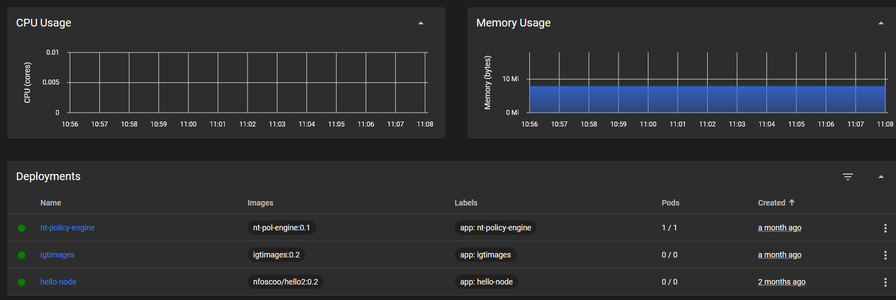

# Rancher Desktop Notes

After you have installed Rancher Desktop on your mac, windows or linux, you might want to add some resources to your Kubernetes.
Below I have described some howtos and gathered some links.

## Install Kubernetes Dashboard

[How to install Kubernetes Dashboard](https://rancher.com/docs/k3s/latest/en/installation/kube-dashboard/)

Here is an example from Kubernetes dashboard:



Get logon token:

``` bash
kubectl -n kubernetes-dashboard describe secret admin-user-token | grep '^token'
```

Forward Kubernetes Dashboard in Rancher Desktop GUI, or by "kubectl proxy".

## Example import image

Log on to registry:

`` bash
nerdctl login -u `oc whoami` -p `oc whoami --show-token` http-route-to-registry/openshift
```

```bash
nerdctl -n k8s.io pull default-route-openshift-image-registry.apps.ocpdq02.norsk-tipping.no/openshift/newsfrontendv1:dev
```

## Create image

### Pull base image

Pull ubi 7 image from Red Hat:

``` bash
nerdctl -n k8s.io pull registry.access.redhat.com/ubi7/ubi:7.9-556
```

## Build image

Create Dockerfile. Here is an example:

``` Dockerfile
FROM registry.access.redhat.com/ubi7/ubi:7.9-556

LABEL maintainer="Jonas Larsen <jonas.larsen@norsk-tipping.no>"

RUN mkdir /files
COPY files/epel7.repo /etc/yum.repos.d/epel.repo
COPY files/policy-engine-201701021029-90.el7.x86_64.rpm /files/

RUN yum install -y --enablerepo=epel bind-utils.x86_64 nc && \
    yum localinstall -y files/policy-engine-201701021029-90.el7.x86_64.rpm && \
    yum clean all

ADD peconf /var/lib/policy-engine/endpoints/

RUN mkdir /var/lib/policy-engine/consumers

EXPOSE 8989

CMD /usr/sbin/policy-engine --enable-mgmt --mgmt-port 8989 --log-level INFO --mgmt-host 0.0.0.0
```

``` bash
nerdctl -n k8s.io build --tag nt-pol-engine:0.1 .
```

### Run image interactive

``` bash
nerdctl -n k8s.io run -p 8080:8988 -it --rm nt-pol-engine:0.1
```

### Run image non interactive

``` bash
nerdctl -n k8s.io run -p 8080:8988 --rm nt-pol-engine:0.1
```

### Create deployment

``` bash
kubectl create deployment nt-policy-engine --image=nt-pol-engine:0.1 -n jonas
```

## Install ArgoCD

### Operator

[How to install ArgoCD](https://operatorhub.io/operator/argocd-operator)

``` text
Install on Kubernetes

    Install Operator Lifecycle Manager (OLM), a tool to help manage the Operators running on your cluster.
    $ curl -sL https://github.com/operator-framework/operator-lifecycle-manager/releases/download/v0.20.0/install.sh | bash -s v0.20.0
    Copy to Clipboard

    Install the operator by running the following command:
    What happens when I execute this command?
    $ kubectl create -f https://operatorhub.io/install/argocd-operator.yaml
    Copy to Clipboard

    This Operator will be installed in the "operators" namespace and will be usable from all namespaces in the cluster.

    After install, watch your operator come up using next command.
    $ kubectl get csv -n operators
    Copy to Clipboard

    To use it, checkout the custom resource definitions (CRDs) introduced by this operator to start using it.
```

### Create ArgoCD Server

[ArgoCD Basics](https://argocd-operator.readthedocs.io/en/latest/usage/basics/)

argocd.yaml:

``` yaml
apiVersion: argoproj.io/v1alpha1
kind: ArgoCD
metadata:
  name: example-argocd
  labels:
    example: basic
spec: {}
```

``` bash
kubectl create -n argocd -f argocd.yaml

```

You can now verify your installation by forwarding the argocd-server listening port and log in.


To log in I advice to set a simpler admin password:

``` bash
kubectl -n argocd patch secret example-argocd-cluster \
  -p '{"stringData": {
    "admin.password": "test123"
  }}'
```

Log in on address "https://localhost:port_forwaded".

## More to come
